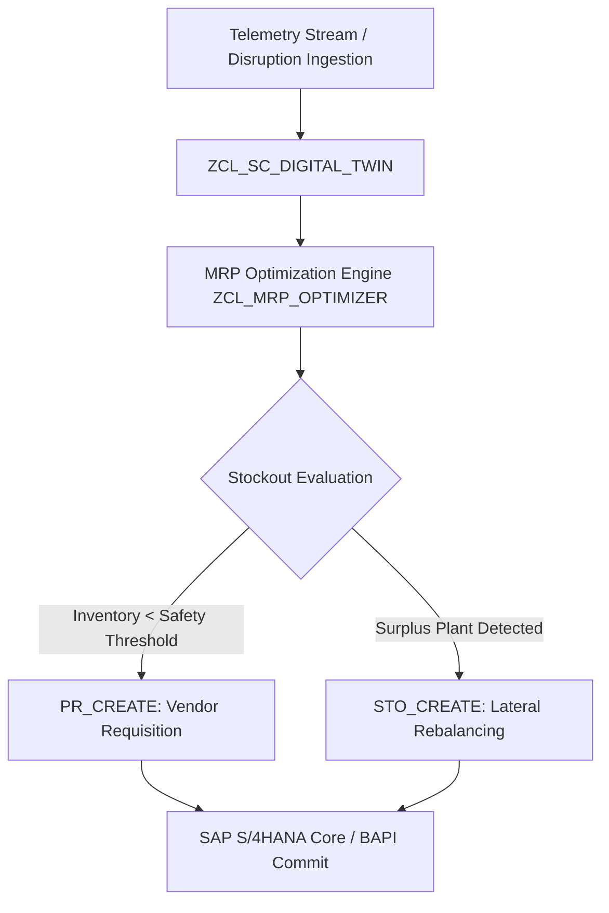

# ABAP-SUPPLY-CHAIN-DIGITAL-TWIN 
## Executive Overview
An enterprise-grade **Supply Chain Digital Twin** engineered for the **SAP NetWeaver / S/4HANA** platform in **Object-Oriented ABAP (ABAP Objects 7.50+)**. It autonomously models multi-echelon procurement topologies, tracks real-time inventory buffers across global plant networks, simulates supplier disruptions (e.g. shipping bottlenecks, factory halts), and automatically synthesises SAP **Purchase Requisitions (PRs)** and lateral **Stock Transport Orders (STOs)** via standard BAPI interfaces (`BAPI_PO_CREATE1`).

## System Architecture



### Key Modules & Components
- **`src/DDIC_STRUCTURES.abap`**: Core Data Dictionary (DDIC) structures defining `ty_plant_node`, `ty_supplier_edge`, and `ty_action_recommendation`.
- **`src/ZIF_SC_SIMULATOR.abap`**: Interface contract defining simulation lifecycle hooks, event dispatchers, and invariant checks.
- **`src/ZCL_SC_DIGITAL_TWIN.abap`**: Primary simulation controller handling plant networks, supplier graphs, and lateral rebalancing.
- **`src/ZCL_MRP_OPTIMIZER.abap`**: Material Requirements Planning (MRP) heuristic calculating dynamic net requirements and economic transfer batches.
- **`runner/run.js`**: Universal execution harness simulating SAP runtime state machines and producing verified telemetry.

## Algorithmic Foundations

### Net Requirements & Stock Coverage
For each plant i with current stock S_i, safety buffer B_i, and daily demand D_i, the stock coverage in days is:
$$\text{Cover}_i = \frac{S_i}{D_i}$$

When $\text{Cover}_i < \tau_{\text{safety}}$ (7 days):
$$\text{Order Quantity} = (2 \times B_i) - S_i$$

### Lateral Stock Rebalancing (STO)
Between surplus plant j ($S_j > 1.5 B_j$) and deficit plant i ($S_i < B_i$), the rebalancing transfer quantity is:
$$Q_{j \to i} = \min(S_j - B_j, B_i - S_i)$$

## Native SAP ABAP Verification
1. Import source files into SAP NetWeaver via **abapGit** or Eclipse ADT (ABAP Development Tools).
2. Activate DDIC structures in transaction `SE11`.
3. Activate classes in transaction `SE24`.
4. Execute test driver report in transaction `SE38`.

## Universal Execution Runner
Run the verified simulation directly on any machine without SAP GUI:
```bash
node runner/run.js
# Or via master orchestrator
node orchestrator/run.js --project=01-abap
```

## Interview Talking Points & Technical Depth
- **Why ABAP Objects?** Enforces strict encapsulation, unit testability via ABAP Unit (`cl_aunit_assert`), and seamless interoperability with SAP Core Data Services (CDS) and BAPIs.
- **Handling Governor Limits:** Utilizes internal hashed tables (`TYPE HASHED TABLE WITH UNIQUE KEY`) for O(1) supplier lookups, avoiding costly sequential table scans in mass MRP processing.
- **Resilience:** Implements failover lateral inventory transfers to prevent assembly line stoppages before committing external purchase orders.\n
